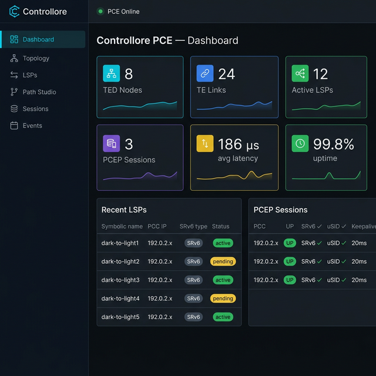
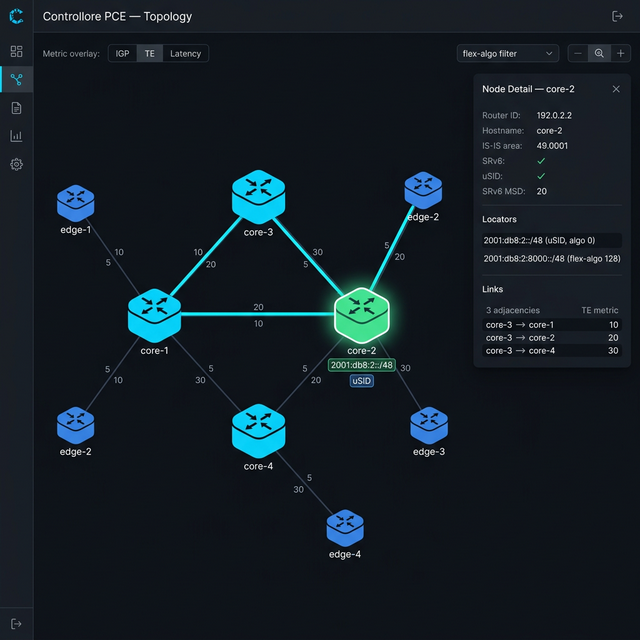
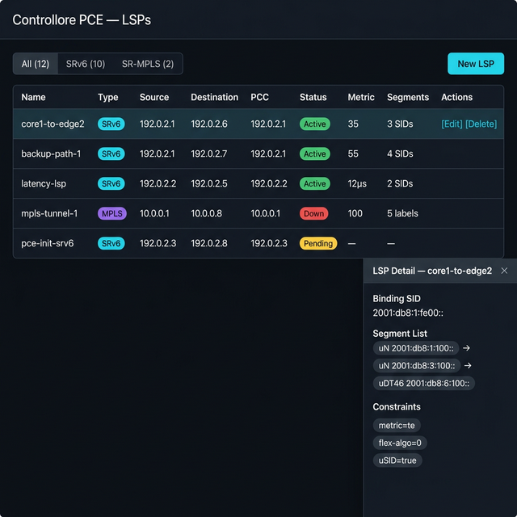
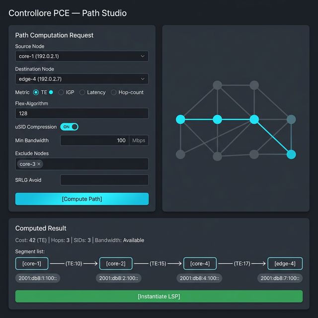
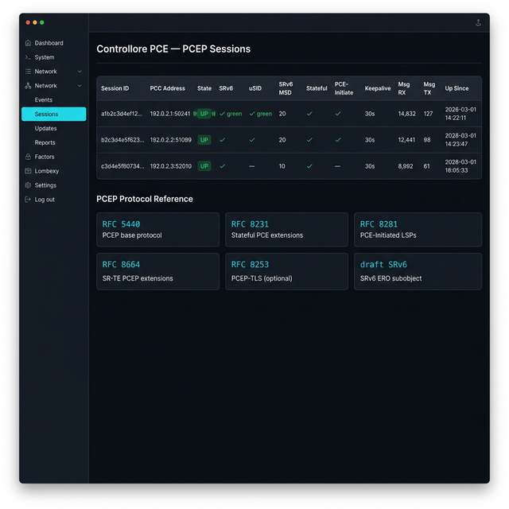
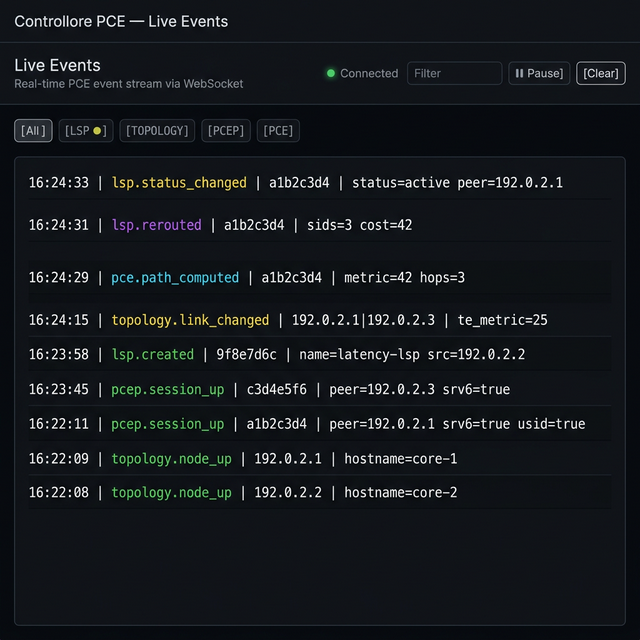

# Controllore

**SRv6 / SR-MPLS Stateful Path Computation Element (PCE)**

Controllore is an open-source, API-first stateful PCE controller built for large service provider wide-area networks. It discovers the network topology via BGP-LS, stores a live Traffic Engineering Database (TED), computes constrained shortest paths (CSPF) for SRv6 and SR-MPLS policies, and controls network devices via PCEP. All functionality is exposed through a REST + WebSocket API consumed by a rich web UI and a full-featured CLI client.

---

## Key Features

| Feature | Detail |
|---------|--------|
| **Topology Discovery** | BGP-LS (RFC 9514, RFC 9085) via embedded GoBGP peer |
| **Traffic Engineering DB** | In-memory TED: nodes, links, SRv6 locators, SID behaviors, TE attributes |
| **Path Computation** | CSPF (Dijkstra) with TE metric, latency, hop-count, bandwidth, SRLG, affinity, node-exclusion constraints |
| **SRv6 uSID** | Full uSID carrier compression (draft-ietf-spring-srv6-srh-compression) |
| **Flex-Algorithm** | Per-algo topology views (128–255); paths computed within a specific flex-algo domain |
| **PCEP Server** | RFC 5440, RFC 8231 (stateful), RFC 8281 (PCInitiate), RFC 8664 (SR), draft SRv6 extensions |
| **API-First** | REST + WebSocket; CLI and Web UI are pure API clients |
| **SRv6 Endpoint Behaviors** | End, End.X, End.DT4/6/46, End.B6.Encaps, uN, uA, uDT4/6/46 |
| **Open Router** | Reference integration with FRRouting (FRR) `pathd` as PCEP PCC and BGP-LS source |
| **Observability** | Prometheus metrics endpoint, structured JSON/console logging (zerolog) |
| **Security** | PCEP-TLS (configurable), JWT auth (configurable), RBAC (in progress) |

---

## Architecture

See [ARCHITECTURE.md](ARCHITECTURE.md) for the full system design, including:

- High-level component diagram
- TED data model (Node, Link, LSP, Segment, Locator)
- API endpoint reference
- SRv6 uSID and flex-algorithm design
- PCEP session state machine
- FRR integration topology
- Repository structure

**Brief overview:**

```
  CLI (Go/Cobra)          Web UI (React)          External / OSS
       │                       │                        │
       └───────────────────────┴────────────────────────┘
                               │  REST + WebSocket
              ┌────────────────▼─────────────────────┐
              │          API Server (Fiber)            │
              └──────┬──────────────┬─────────────────┘
                     │              │
              ┌──────▼─────┐  ┌─────▼──────────────┐
              │    TED     │  │  PCEP Session Mgr   │
              │  Manager   │  │  (RFC 8231/8281)    │
              └──────┬─────┘  └─────────────────────┘
                     │
              ┌──────▼─────────────────────────────┐
              │   CSPF Engine  ·  LSP Manager       │
              │   Event Bus    ·  BGP-LS Collector   │
              └──────────────────────────────────────┘
                               │
              ┌────────────────▼──────────────────────┐
              │      Network Fabric (FRR PCCs)         │
              │  BGP-LS ──► TED   PCEP ◄──► pathd     │
              └───────────────────────────────────────┘
```

---

## Repository Layout

```
controllore/
├── cmd/
│   ├── pced/               # pced — PCE daemon entry point
│   └── cli/                # controllore — CLI binary
├── internal/
│   ├── api/                # Fiber REST + WebSocket handlers
│   ├── pcep/               # PCEP server, session state machine, wire codec
│   ├── ted/                # Traffic Engineering Database
│   ├── cspf/               # CSPF path computation engine
│   ├── lsp/                # LSP lifecycle manager
│   ├── events/             # Internal pub/sub event bus
│   └── config/             # Viper configuration loader
├── pkg/
│   ├── pcep/               # Exportable PCEP protocol types
│   └── srv6/               # SRv6 SID/locator types, uSID compression
├── ui/                     # React + TypeScript web UI (Vite)
│   └── src/pages/          # Dashboard, Topology, LSPs, Path Studio, Events
├── deploy/
│   ├── docker-compose.yml  # Full stack: pced + DB + FRR + observability
│   ├── Dockerfile          # Multi-stage Go build
│   ├── controllore.yaml    # Reference configuration file
│   ├── frr/                # FRR reference configs (IS-IS SRv6 + pathd)
│   └── prometheus/         # Prometheus scrape config
├── ARCHITECTURE.md         # Full design document
├── INSTALL.md              # Installation instructions
├── go.mod
└── README.md
```

---

## Screenshots

### Dashboard
Real-time PCE health overview — TED stats, active LSPs, PCEP session status.



### Topology Viewer
Interactive Cytoscape.js network graph with TE metric overlays, flex-algo filtering, and per-node SRv6 locator details.



### LSP Management
Full LSP lifecycle table with type/status/metric filtering, side-panel segment list, and uSID SID pills.



### Path Studio
CSPF computation form with constraint inputs (metric, flex-algo, uSID, SRLG avoidance) and computed segment list visualization.



### PCEP Sessions
Live session table with per-PCC SRv6/uSID capabilities, message counters, and protocol reference cards.



### Live Events
Real-time WebSocket event stream with color-coded event types, filter, and pause/resume.



---

## Quick Start

### Prerequisites

- **Go** ≥ 1.21 — [golang.org/dl](https://golang.org/dl/)
- **Node.js** ≥ 20 — [nodejs.org](https://nodejs.org/)
- **Docker + Docker Compose** — for the full stack option

See [INSTALL.md](INSTALL.md) for complete installation instructions.

### Build & Run (No Docker)

```bash
# Clone
git clone https://github.com/buraglio/controllore.git
cd controllore

# Build the daemon and CLI
go build -o pced  ./cmd/pced
go build -o controllore ./cmd/cli

# Copy and edit the config
cp deploy/controllore.yaml ./controllore.yaml
# Edit controllore.yaml with your BGP-LS peer addresses

# Start the PCE daemon
./pced --config ./controllore.yaml

# In another terminal — verify the API is up
curl http://localhost:8080/api/v1/health
```

### Full Stack with Docker Compose

```bash
cd deploy
docker compose up -d

# Services:
#   API + PCEP:  http://localhost:8080   / tcp/4189
#   Web UI:      http://localhost:5173
#   Prometheus:  http://localhost:9090
#   Grafana:     http://localhost:3001   (admin / controllore)
```

### Web UI (development)

```bash
cd ui
npm install
npm run dev
# Open http://localhost:5173
```

---

## CLI Reference

```
controllore [--api-url http://host:8080] [--output table|json] <command>

TOPOLOGY
  controllore topology show              Full topology snapshot
  controllore topology nodes             List all TED nodes
  controllore topology node <router-id>  Node detail + SRv6 locators
  controllore topology segments          All advertised SRv6 SIDs

LSP MANAGEMENT
  controllore lsp list [--type srv6|mpls] [--pcc <ip>]
  controllore lsp show <id>
  controllore lsp create \
      --src 192.0.2.1 --dst 192.0.2.5 \
      --type srv6 --metric te \
      --usid --flex-algo 128 \
      --bw 1000000
  controllore lsp history <id>
  controllore lsp delete <id>

PATH COMPUTATION (non-instantiating CSPF)
  controllore path compute \
      --src 192.0.2.1 --dst 192.0.2.5 \
      --metric te --usid

PCEP SESSIONS
  controllore session list

LIVE EVENTS
  controllore events watch              Stream events (WebSocket)

CONFIG
  controllore config show
  controllore config set-url http://pce.example.com:8080

GLOBAL FLAGS
  --api-url   string   API base URL (env: CONTROLLORE_API_URL)
  --output    string   Output format: table (default) or json
```

---

## REST API Overview

Base URL: `http://host:8080/api/v1`

| Method | Path | Description |
|--------|------|-------------|
| `GET` | `/health` | Daemon health + TED summary |
| `GET` | `/topology` | Full topology (nodes + links) |
| `GET` | `/topology/nodes` | All TED nodes |
| `GET` | `/topology/nodes/:id` | Node detail + SRv6 locators |
| `GET` | `/topology/links` | All TE links |
| `GET` | `/topology/segments` | All SRv6 SIDs / locators |
| `GET` | `/topology/export?fmt=dot` | GraphViz DOT export |
| `GET` | `/lsps` | List LSPs (`?type=srv6&pcc=...`) |
| `POST` | `/lsps` | Create LSP via CSPF + PCInitiate |
| `GET` | `/lsps/:id` | LSP detail + segment list |
| `PATCH` | `/lsps/:id` | Update constraints / recompute |
| `DELETE` | `/lsps/:id` | Teardown LSP |
| `GET` | `/lsps/:id/history` | LSP change history |
| `POST` | `/paths/compute` | CSPF (no instantiation) |
| `POST` | `/paths/disjoint` | Primary + disjoint backup |
| `GET` | `/sessions` | PCEP sessions |
| `GET` | `/sessions/:id` | Session capabilities + counters |
| `GET` | `/metrics` | Prometheus text format |

**WebSocket endpoints:**

| Path | Description |
|------|-------------|
| `ws://host/ws/events` | All PCE events (LSP, topology, PCEP) |
| `ws://host/ws/topology` | Topology deltas with full snapshot on connect |

---

## Relevant Standards

| RFC / Draft | Title |
|-------------|-------|
| RFC 4655 | PCE Architecture |
| RFC 5440 | Path Computation Element Communication Protocol (PCEP) |
| RFC 8231 | Stateful PCE Extensions |
| RFC 8281 | PCE-Initiated LSPs (PCInitiate) |
| RFC 8402 | SR Architecture |
| RFC 8664 | PCEP Extensions for SR Policy |
| RFC 8754 | SRv6 Network Encoding |
| RFC 8986 | SRv6 Network Programming |
| RFC 9085 | BGP-LS Extensions for SR |
| RFC 9252 | BGP SRv6 for SRv6-based Services |
| RFC 9514 | BGP-LS Extensions for SRv6 |
| draft-ietf-pce-segment-routing-ipv6 | PCEP Extensions for SRv6 ERO |
| draft-ietf-spring-srv6-srh-compression | SRv6 uSID compression |

---

## FRR Integration

Controllore is designed to interoperate with [FRRouting](https://frrouting.org/) operating as:

1. **BGP-LS source** — FRR `bgpd` exports IS-IS-SR topology via the BGP-LS address family
2. **PCEP PCC** — FRR `pathd` connects to Controllore's PCEP server on port 4189

A reference FRR configuration is provided in [`deploy/frr/frr.conf`](deploy/frr/frr.conf), demonstrating:
- IS-IS with SRv6 locator and uSID configuration
- BGP-LS peering toward the PCE
- Flex-algorithm 128 (latency) and 129 (TE) definitions
- `pathd` PCEP client configuration for a delegated SR policy

---

## Technology Stack

| Layer | Technology |
|-------|------------|
| Language | Go 1.21+ |
| API Server | [Fiber v2](https://gofiber.io/) + WebSocket |
| BGP-LS | [GoBGP v3](https://github.com/osrg/gobgp) |
| PCEP | Custom Go implementation (RFC 5440 + extensions) |
| Path Computation | Custom Dijkstra/CSPF |
| Configuration | [Viper](https://github.com/spf13/viper) (YAML + env) |
| CLI | [Cobra](https://github.com/spf13/cobra) |
| Database | PostgreSQL ([pgx](https://github.com/jackc/pgx)) |
| Cache | Redis ([go-redis](https://github.com/redis/go-redis)) |
| Logging | [zerolog](https://github.com/rs/zerolog) |
| Metrics | [Prometheus client](https://github.com/prometheus/client_golang) |
| JWT Auth | [golang-jwt](https://github.com/golang-jwt/jwt) |
| Web UI | React 18 + TypeScript (Vite) |
| Topology Graph | [Cytoscape.js](https://cytoscape.org/) |
| Containerization | Docker + Docker Compose |

---

## Development Status

> This project is under active development. Core subsystems compile and the API is functional. Some features are scaffolded pending full implementation.

| Component | Status |
|-----------|--------|
| Go module + dependencies | ✅ Complete |
| Config loader (Viper) | ✅ Complete |
| TED (in-memory) | ✅ Complete |
| PCEP server + session SM | ✅ Complete |
| CSPF engine + uSID | ✅ Complete |
| SRv6 type library | ✅ Complete |
| LSP lifecycle manager | ✅ Complete |
| Event bus | ✅ Complete |
| REST + WebSocket API | ✅ Complete |
| CLI client | ✅ Complete |
| React Web UI | ✅ Complete |
| Docker Compose stack | ✅ Complete |
| FRR reference config | ✅ Complete |
| BGP-LS NLRI parser | ✅ Complete |
| PCEP message handlers (PCRpt/PCUpd) | ✅ Complete |
| PostgreSQL persistence | ✅ Complete |
| PCEP-TLS | 🔧 Configurable, wiring pending |
| JWT authentication | 🔧 Configurable, middleware pending |
| SR-MPLS label stack | 📋 Planned |
| IS-IS SR direct parser | 📋 Planned |
| Grafana dashboards | 📋 Planned |

---

## Contributing

Contributions are welcome. Please open an issue before submitting large pull requests.

```bash
# Run all checks
go build ./...
go vet ./...
go test ./...

# Build the UI
cd ui && npm run build
```

See [ARCHITECTURE.md](ARCHITECTURE.md) for design context before contributing.

---

## License

Apache 2.0 — see `LICENSE` for details.
